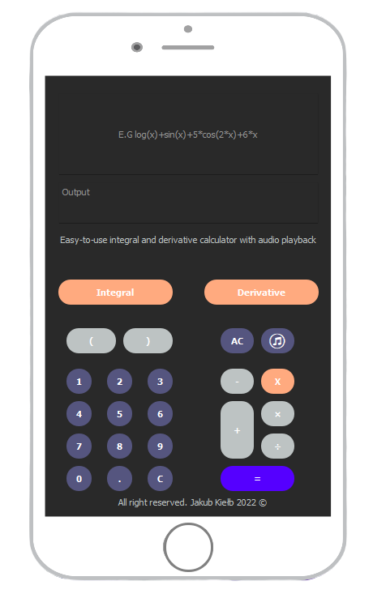
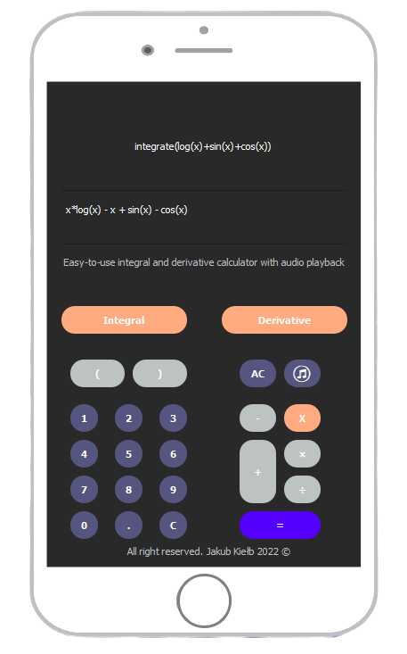

# Integral-and-derivative-calculator


`pip install PyQt5`

`pip install sympy`


## eval() Function

```python
expression = "A String, that will be evaluated as Python code"
globals = "Optional. A dictionary containing global parameters"
locals = "Optional. A dictionary containing local parameters"
eval(expression, globals, locals)
```

## Winsound 

```python
 import winsound
 winsound.PlaySound(r'file.wav', winsound.SND_ASYNC)
```
\
\

\
\

